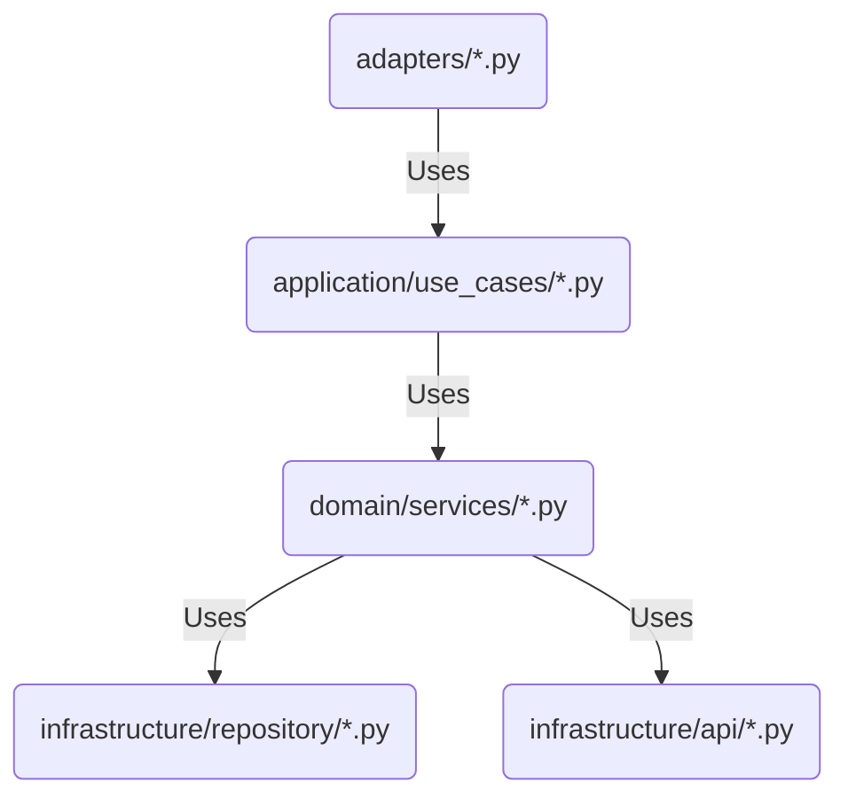

## Running Requirements
* Docker and docker-compose (either plugin or standalone)
* Make

## Running instructions
1. `make run`
2. Go to `http://localhost:8000/` to see the swagger documentation


## How to review

The architecture is based on Hexagonal Architecture, with the following layers:
 (credits to vrogue.co)
- **Application**: Business logic
- **Adapters**: Input ports (FastAPI requests and updates)
- **Domain**: Data models
- **Infrastructure**: Output ports (database, request external services api, configuration)
- **Main**: FastAPI

### Request flow

Because it can be a bit complex to understand the flow, here is a diagram to help you:


### Data event update
1. At star-up, main.py will init the configuration of the ports (external provider and Redis database)
2. The use case will fetch and parse the events from the external provider
3. Then persist the events in the Redis database


> **_NOTE:_**  To store again the events, **restart** the application, stored events will be overwritten

### Request to fetch events
1. Retrieve cached configuration
2. Retrieve events from Redis

### Extra review
Documentation about decisions can be found in [doc/adr](doc/adr) folder


## The extra mile

### How to scale this application focusing on performance
1. **Measure**: Performance testing, use tools like `locust.io` or `Gatling` to simulate multiple users
2. **Monitor**:
    - Use tools like `Prometheus` and `Grafana` to monitor FastAPI and `RedisInsight` and `Sentinel` to monitor Redis
3. **Mitigate**:
    - Async events timely, cron jobs with `ARQ scheduler`
    - Increase number of FastAPI instances
    - _Redis_:
      - Redis Sentinel: monitoring and failover configuration
      - Partitioning (sharding)
      - Replication (data redundancy and read scalability)
      - Persistence configuration (AOF, RDB)
      - Redis cluster (vertical and horizontal scalability)

### How to scale this application focusing on adding new providers
1. Modify the configuration file to add new providers [config.yaml](app/infrastructure/config/localhost/config.yaml)
2. Add a new `provider_*.py` in [infra layer](app/infrastructure/api/external_providers) being sure to implement the `ExternalProvider` interface
3. Add a new repository in [repository layer](app/infrastructure/repository) to store and retrieve the data from the new provider implementing the `EventRepository` interface


### How to scale this application focusing on traceability
1. **Logging**:
    - Use structured logging with `loguru` to log events and errors
    - Use `Correlation ID` to track requests across services
2. **Monitoring**: Use **Event Source** to have a record of events and errors and persists them in the database in the
sequence they occurred. This can be used to replay events and restore the state of the application.
3. **Tracing**:
    - Use `Jaeger` or `Zipkin` to trace requests across services
    - Use `OpenTelemetry` to instrument the code

### How to be ready for production
- Create a new config folder with `config.yml` and `config_test.yml` for production environment

### How to set up the dev environment
Recommended to install `pydev`
```bash
pyenv install 3.12.2
$(pyenv which python3.12) -m venv .venv
source .venv/bin/activate
pip install --upgrade pip
pip install poetry
poetry install
make dev-build
make run-dependencies
make run-standalone
```

## How to run all tests

```bash
make test
```

## How to run type checking and formating

```bash
make lint
```

## Features implemented:
### Performance
- [X] Async Web server (FastAPI)
- [X] Cache
- [X] Sync events at startup

### Architecture
- [X] Hexagonal Architecture
- [X] Extendability by yml configuration
- [X] Dependency Injection
- [X] Request Validation
- [X] Response Validation

### Consistency, availability and scalability (multiple FastAPI instances, Redis partition)
- [X] Persistency in Redis

### Code Quality (error handling, logging, set up, etc)
- [X] Swagger documentation
- [X] Configuration
- [X] ADRs (Documentation about decisions)
- [X] Isolated environment to run (Docker, pyenv)
- [X] Package manager (poetry)
- [X] Basic error handling on Adapters (fetching and XML parsing, database access, etc.)
- [X] Circuit Breaker
- [X] Retry
- [X] Transaction (Redis pipeline)
- [X] Basic Logging
- [X] Testing
- [X] Code coverage
- [X] Linting
- [X] Formatting
- [X] Type checking
- [X] Makefile
- [X] Pre-commit hooks
- [X] CI/CD with GitHub actions
- [X] GitHub actions badge

## Future work
- [ ] Add performance testing
- [ ] Add penetration testing
- [ ] Add monitoring and tracing
- [ ] Add security (OAuth 2.0, JWT, https, throttling)
- [ ] Add async events, either timely (ARQ jobs scheduler) or per each request (FastApi) background task
- [ ] Redis Fetching in batching
- [ ] Improve description in error handling parsing XML
- [ ] [JSON document index](https://redis.readthedocs.io/en/stable/examples/search_json_examples.html) **when** performance is not the main focus as described
- [ ] Store circuit breaker status in redis to sync multiple instances
- [ ] Improve timezone awareness (events without, request within timezone)
- [ ] CodeQL

------------------------------------------------------------------------------------------------------------------------


# Feedback

1. **Ensuring Requirement Compliance**: It is crucial to verify that all project requirements, such as retrieving past events and filtering online events, are fully met to align with stakeholder expectations and project goals.
2. **Optimizing Provider Separation**: Extending the separation to different parts of the business in terms of persistence would be beneficial. Creating a normalized model for the Fever's application would allow for more efficient modeling, transformation, and importing of events from the internal providers service. This would optimize event retrieval endpoints and improve overall performance.
3. **Event Loss Management**: Currently, event loss can be an issue, especially if a single event fails among thousands.
4. **Improving Test Coverage**: Including tests for critical scenarios, such as updating event properties and handling transitions between online and offline states, would ensure more comprehensive test coverage, reducing the likelihood of undetected bugs.
5. **Refining Design for Flexibility**: Addressing design concerns, such as avoiding event filtering before saving and differentiating events with the same ID from different providers, would improve the system's flexibility and adaptability for future changes and requirements. Let's think about how we would implement an endpoint to retrieve a single event by ID but respecting current already implemented SEARCH all events endpoint. An internal standarized ID for all our events would help for this purpose.
6. **Optimizing Implementation for Use Cases**: Resolving implementation limitations, such as exclusive reliance on Redis caching for retrieving past events, would better align the system with business use cases and improve overall functionality and usability.
7. **Applying the Single Responsibility Principle (SRP)**: Separating tests from the source code and applying the Single Responsibility Principle (SRP) at the file level will improve code maintainability, readability, and testability. This will facilitate collaboration and reduce technical debt over time.

------------------------------------------------------------------------------------------------------------------------


# Fever code challenge

Hello! Glad you are on this step of the process. We would like to see how you are doing while coding and this exercise
tries to be a simplified example of something we do on our daily basis.

At Fever we work to bring experiences to people. We have a marketplace of events from different providers that are
curated and then consumed by multiple applications. We work hard to expand the range of experiences we offer to our customers.
Consequently, we are continuosly looking for new providers with great events to integrate in our platforms.
In this challenge, you will have to set up a simple integration with one of those providers to offer new events to our users.

Even if this is just a disposable test, imagine when coding that somebody will pick up this code an maintain it on
the future. It will be evolved, adding new features, adapting existent ones, or even removing unnecessary functionalities.
So this should be conceived as a long term project, not just one-off code.

## Evaluation
We will value the solution as a whole, but some points that we must special attention are:
- How the proposed solution matches the given problem.
- Code style.
- Consistency across the codebase.
- Software architecture proposed to solve the problem.
- Documentation about decisions you made.

## Tooling
- Use Python 3 unless something different has been told.
- You can use any library, framework or tool that you think are the best for the job.
- To provide your code, use the master branch of this repository.

## Description
We have an external provider that gives us some events from their company, and we want to integrate them on the Fever
marketplace, in order to do that, we are developing this microservice.

##### External provider service
The provider will have one endpoint:

https://provider.code-challenge.feverup.com/api/events

Where they will give us their list of events on XML. Every time we fetch the events,
the endpoint will give us the current events available on their side. Here we provide some examples of three different
calls to that endpoint on three different consecutive moments.

Response 1
https://gist.githubusercontent.com/sergio-nespral/82879974d30ddbdc47989c34c8b2b5ed/raw/44785ca73a62694583eb3efa0757db3c1e5292b1/response_1.xml

Response 2
https://gist.githubusercontent.com/sergio-nespral/82879974d30ddbdc47989c34c8b2b5ed/raw/44785ca73a62694583eb3efa0757db3c1e5292b1/response_2.xml

Response 3
https://gist.githubusercontent.com/sergio-nespral/82879974d30ddbdc47989c34c8b2b5ed/raw/44785ca73a62694583eb3efa0757db3c1e5292b1/response_3.xml

As you can see, the events that aren't available anymore aren't shown on their API anymore.

##### What we need to develop
Our mission is to develop and expose just one endpoint, and should respect the following Open API spec, with
the formatted and normalized data from the external provider:
https://app.swaggerhub.com/apis-docs/luis-pintado-feverup/backend-test/1.0.0

This endpoint should accept a "starts_at" and "ends_at" param, and return only the events within this time range.
- It should only return the events that were available at some point in the provider's endpoint(the sell mode was online, the rest should be ignored)
- We should be able to request this endpoint and get events from the past (events that came in previous API calls to the provider service since we have the app running) and the future.
- The endpoint should be fast in hundred of ms magnitude order, regardless of the state of other external services. For instance, if the external provider service is down, our search endpoint should still work as usual.

Example: If we deploy our application on 2021-02-01, and we request the events from 2021-02-01 to 2022-07-03, we should
see in our endpoint the events 291, 322 and 1591 with their latest known values.

## Requirements
- The service should be as resource and time efficient as possible.
- The Open API specification should be respected.
- Use PEP8 guidelines for the formatting
- Add a README file that includes any considerations or important decision you made.
- If able, add a Makefile with a target named `run` that will do everything that is needed to run the application.

## The extra mile
With the mentioned above we can have a pretty solid application. Still we would like to know your opinion, either
directly coded (if you want to invest the time) or explained on a README file about how to scale this application
to focus on performance. The examples are small for the sake of the test, but imagine that those files contains
thousands of events with hundreds of zones each. Also consider, that this endpoint developed by us, will have peaks
of traffic between 5k/10k request per second.

## Feedback
If you have any questions about the test you can contact us, we will try to reply as soon as possible.

In Fever, we really appreciate your interest and time. We are constantly looking for ways to improve our selection processes,
our code challenges and how we evaluate them. Hence, we would like to ask you to fill the following (very short) form:

https://forms.gle/6NdDApby6p3hHsWp8

Thank you very much for participating!
